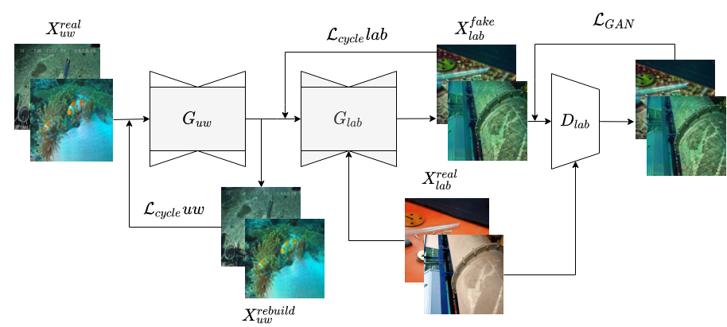

# Underwater image-to-image translation using CycleGAN in PyTorch


## Prerequisites
- Linux OS
- Python 3
- CPU or NVIDIA GPU + CUDA CuDNN

## Getting Started
### Installation

- Clone this repo:
    ```bash
    git clone https://github.com/ioannispol/UnderWaterGAN.git
    cd UnderWaterGAN
    ```
- Some sample scripts are provided in `./scripts`. Before you can run them the first time, set execute permission via  
`chmod +x -R ./scripts/`

- Install dependencies via [pip](https://pypi.org/project/pip/)  
`#!./scripts/install_deps.sh`
  - [PyTorch](https://pytorch.org/get-started/locally/)
  - [visdom](https://github.com/facebookresearch/visdom)
  - For all other dependencies, use the command  
    `pip install -r requirements.txt`.
    
### Prepare Your Dataset
To train a model on your own dataset, you need to create a data folder with two subdirectories `trainA` and `trainB` that contain images from domain A and B (unaired). You can test your model on your training set by setting `--phase train` in `test.py`. You can also create subdirectories `testA` and `testB` if you have test data.

### Training and Testing
- Prepare your dataset as described above
- To view training results and loss plots, run `python -m visdom.server` and click the URL http://localhost:8097.
- Train a model:
  ```bash
  #!./scripts/train_cyclegan.sh
  python train.py --dataroot /{path_to_train_data} --name {experiment_name}
  ```
  - To specify more train options, see the files in the directory `./options/train_options.py`
  - To see more intermediate results, check out `./results/{experiment_name}/web/index.html`.
- Test the model:
  ```bash
  #!./scripts/test_cyclegan.sh
  python test.py --dataroot /{path_to_test_data} --name {experiment_name} --model cycle_gan
  ```
  - To specify more test options, see the files in the directory `./options/test_options.py`
  - The test results will be saved to a html file here: `./results/{experiment_name}/test_latest/index.html`.
  - The (pre-)trained model is saved at `./results/{experiment_name}/latest_net_G_{A_or_B}.pth`.
  - The option `--model test` is used for generating results of CycleGAN only for one side. This option will automatically set `--dataset_mode single`, which only loads the images from one set. In this case it might be neccesary to specify `--model_suffix "_{A_or_B}"` to find the correct models.  
  On the contrary, using `--model cycle_gan` requires loading and generating results in both directions, which is sometimes unnecessary.
  - The results will be saved at `./results/`. Use `--results_dir {directory_path_to_save_result}` to specify the results directory.

## Network architecture For Cycle A to B


## Citation
If you use this project for your research, please cite our [paper].


### ToDo
- [ ] Add evaluation scripts 
- [ ] Make evaluation scripts for FID and SSIM-py 
- [ ] Paper TBR

## Acknowledgments
The project is forked from [m4ln/stainTransfer_CycleGAN_pytorch: Image-to-Image Translation in PyTorch](https://github.com/m4ln/stainTransfer_CycleGAN_pytorch).
Only a few parts are modified or added. Please refer to this project for more details on the project files.
# UnderWaterGAN
